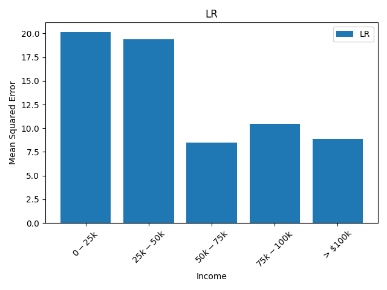
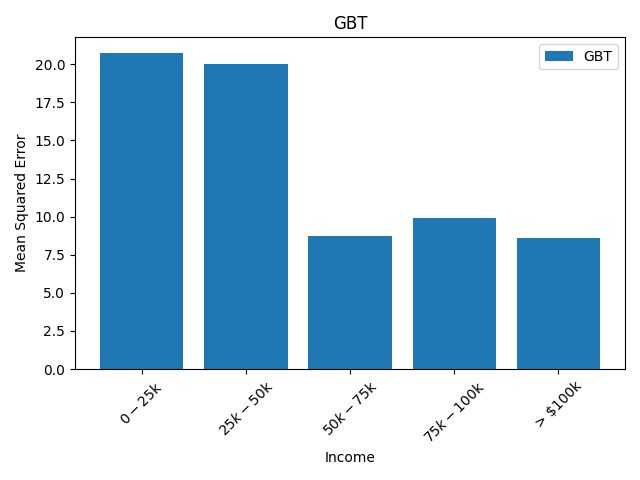
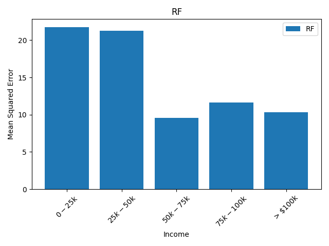

# The Role of Bias in Fairness Metrics: Unveiling Disparities in Mean Squared Error

As industries increasingly rely on machine learning (ML) models to make decisions, ensuring fair and equitable outcomes becomes paramount. The evaluation of fairness metrics, such as Mean Squared Error (MSE), is crucial for understanding disparities among different demographic groups. Today, we'll delve into how bias in data can manifest in MSE discrepancies across income groups within a Logistic Regression (LR) model.



The above bar graph presents MSE across five income brackets as determined by an LR model. A clear trend emerges: the MSE is substantially higher for individuals with an annual income of less than $50,000.

## Dissecting the Disparity
MSE is an essential error metric in ML. It computes the average squared difference between actual and predicted outcomes, thereby quantifying the model's 'prediction error'. A high MSE suggests that the model's predictions significantly deviate from actual values, indicating poor model performance.

This pronounced MSE disparity among income groups points towards a pervasive issue: bias in data.

## Bias and its implications
Bias occurs when certain elements in the data are over- or under-represented, resulting in skewed predictions. This bias can inadvertently creep into ML models due to the inherent biases in data collection and representation processes.

When it comes to income groups, here's how bias may play a role:

1. Insufficient Representation: Lower-income individuals may be underrepresented in the data set. As a result, the model struggles to accurately capture and learn patterns within this group, leading to higher prediction errors.

2. Bias in Feature Selection: The features included in the model might be more relevant or accurate for higher income groups, causing lower performance when predicting for lower-income individuals. For instance, if a model heavily relies on features like credit scores, which could be more stable in higher income groups, it might fail to make accurate predictions for lower-income groups.

3. Socioeconomic Complexity: Lower-income groups might experience more variability in their circumstances, adding to the difficulty of making accurate predictions. However, if the data doesn't capture this complexity—due to bias in data collection or feature selection—it results in higher MSE for these groups.

Addressing bias is a significant step towards fair ML models. By understanding its origins and manifestations, we can employ techniques to mitigate its effects, fostering equitable predictions across all income groups. Bias in data is not just a data science issue—it's a matter of social justice. Let's ensure our models reflect that.

## Exploring Fairness Across Models

To gain a deeper understanding of the biases inherent in our data, it is crucial to examine the performance of various models. By comparing the MSE of different models across the same income groups, we can discern whether the high error rates for lower-income individuals are a general problem or tied to the LR model.

<p float="left">
  
  
</p>

The above plots showcase the performance of different models, each providing unique insights into the representation of bias in our data. For example, if the high MSE for lower-income groups persists across all models, it suggests a pervasive bias in the data that must be addressed irrespective of model choice.

Ultimately, the goal is not only to find the best performing model but also to uncover, understand, and mitigate data bias. Only then can we ensure our machine learning models deliver fair and equitable outcomes.

# ChatGPT Use:

For this assignment, I mainly used ChatGPT to help me iterate on my code and improve it. I also used it for learning the materials/tools we are required to use for the assignment. Below, you will find a sample of how I mostly use the chatbot:

## Prompt:
I have this code:

```from pyspark import SparkContext, SparkConf
from datetime import datetime
from pyspark.mllib.stat import Statistics
from pyspark.mllib.linalg import Vectors

conf = SparkConf().setAppName("Chicago Crime Data Analysis")
sc = SparkContext(conf=conf)

# Load the data from HDFS
crimeData = sc.textFile("hdfs://wolf:9000/user/sms5736/03_hw/Crimes_-_2001_to_present.csv")

# Extract header
header = crimeData.first()
crimeData = crimeData.filter(lambda line: line != header)

def parse(line):
    fields = line.split(',')
    date = datetime.strptime(fields[2], '%m/%d/%Y %I:%M:%S %p')
    beat = fields[10]  # adjust field index according to your data
    return (date, beat)

# Parse the RDD
crimeDataParsed = crimeData.map(parse)

# Filter for the last 5 years
most_recent_date = datetime(2019, 12, 31)  # set the most recent date
crimeDataLast5Years = crimeDataParsed.filter(lambda x: x[0].year >= most_recent_date.year - 5)

# Create a set of all unique beats
all_beats = crimeDataLast5Years.map(lambda x: x[1]).distinct().collect()
all_beats_dict = {beat: index for index, beat in enumerate(all_beats)}
num_beats = len(all_beats)

# Count the number of crimes per beat per year and switch the order of beat and year
beatCountsPerYear = crimeDataLast5Years.map(lambda x: ((x[0].year, x[1]), 1)).reduceByKey(lambda a, b: a + b)

# Create a full vector for each year
beatCountsPerYearFull = beatCountsPerYear.map(lambda x: (x[0][0], (all_beats_dict[x[0][1]], x[1]))).groupByKey()

def fill_vector(counts):
    vec = [0] * num_beats
    for beat_index, count in counts:
        vec[beat_index] = count
    return Vectors.dense(vec)

countsVectors = beatCountsPerYearFull.mapValues(fill_vector)

# Compute correlation matrix
correlation_matrix = Statistics.corr(countsVectors.values())

# Print Cor matrix
print(correlation_matrix)

# Open a file to write the result
with open('beat_correlation.txt', 'w') as f:
    for row in correlation_matrix:
        f.write(f"{row}\n")
        
```

===================

Can you explain it to me line by line in depth?

## Response:
Sure, I'll break down the main functionality of each part of your PySpark script.

**Imports**

```
Copy code
from pyspark import SparkContext, SparkConf
from datetime import datetime
from pyspark.mllib.stat import Statistics
from pyspark.mllib.linalg import Vectors
```

These lines import necessary modules:

  - SparkContext, SparkConf: These are fundamental components in PySpark. SparkConf is used to configure the application, and SparkContext is the entry point to any functionality in Spark.
  - datetime: This module from Python's standard library is used to handle dates and times.
  - Statistics: PySpark's module that provides statistical functions.
  - Vectors: PySpark's module to work with vector data, often used in machine learning and statistical functions.

**Setting Up Spark**

```
conf = SparkConf().setAppName("Chicago Crime Data Analysis")
sc = SparkContext(conf=conf)
```

Here you are setting up the Spark context with your app configuration. The app is named "Chicago Crime Data Analysis".

**Loading Data**

```
crimeData = sc.textFile("hdfs://wolf:9000/user/sms5736/03_hw/Crimes_-_2001_to_present.csv")
```

This line loads the data from a CSV file located in HDFS (Hadoop Distributed File System) into an RDD (Resilient Distributed Dataset), a fundamental data structure of Spark.

**Extracting Header**

```
header = crimeData.first()
crimeData = crimeData.filter(lambda line: line != header)
```

Here, you are extracting the header from the data (which is the first line) and then filtering it out from the rest of the data.

**Parsing Data**

```
def parse(line):
    fields = line.split(',')
    date = datetime.strptime(fields[2], '%m/%d/%Y %I:%M:%S %p')
    beat = fields[10]  
    return (date, beat)

crimeDataParsed = crimeData.map(parse)
```

Here, you are defining a function to parse each line of data. Each line is split by commas (since it's a CSV file), and then you are extracting the date and 'beat' (a term used in law enforcement to refer to the territory and time a police officer patrols). The date is parsed into a datetime object, and then a tuple of the date and beat is returned. This function is then applied to each line of the data using the map function.

**Filtering Data**

```
most_recent_date = datetime(2019, 12, 31)  
crimeDataLast5Years = crimeDataParsed.filter(lambda x: x[0].year >= most_recent_date.year - 5)
```

Here, you are filtering the data to only include the last five years. This is done by checking if the year of the date of each data point is greater than or equal to the year of most_recent_date minus five.

**Creating a Set of Unique Beats**

```
all_beats = crimeDataLast5Years.map(lambda x: x[1]).distinct().collect()
all_beats_dict = {beat: index for index, beat in enumerate(all_beats)}
num_beats = len(all_beats)
```

Here, you are creating a list of all unique beats and creating a dictionary that maps each beat to an index. The number of unique beats is also computed.

**Counting Crimes per Beat per Year**

```
beatCountsPerYear = crimeDataLast5Years.map(lambda x: ((x[0].year, x[1]), 1)).reduceByKey(lambda a, b: a + b)
```

Here, you are transforming the data into tuples of the year and beat, each associated with the value 1. These are then reduced by key (the year and beat), which effectively counts the number of crimes per beat per year.

**Creating a Full Vector for Each Year**

```
beatCountsPerYearFull = beatCountsPerYear.map(lambda x: (x[0][0], (all_beats_dict[x[0][1]], x[1]))).groupByKey()

def fill_vector(counts):
    vec = [0] * num_beats
    for beat_index, count in counts:
        vec[beat_index] = count
    return Vectors.dense(vec)

countsVectors = beatCountsPerYearFull.mapValues(fill_vector)
```

Here, you are transforming the data into tuples of the year and a tuple of the beat index and count. These are then grouped by key (the year), which results in an RDD of the year and an iterable of tuples of beat index and count. A function is defined to transform this iterable into a dense vector, and this function is applied to the values of each item in the RDD.

**Computing Correlation Matrix**

```
correlation_matrix = Statistics.corr(countsVectors.values())
```

Here, you are computing a correlation matrix of the vectors of counts using PySpark's Statistics.corr function. This matrix represents the correlations between the counts of crimes in different beats in the same year.

**Printing Correlation Matrix**

```
print(correlation_matrix)
```

This line prints the correlation matrix.

**Writing the Correlation Matrix to a File**

```
with open('beat_correlation.txt', 'w') as f:
    for row in correlation_matrix:
        f.write(f"{row}\n")
```

Here, you are writing the correlation matrix to a file named 'beat_correlation.txt'. Each row of the matrix is written as a separate line in the file.
